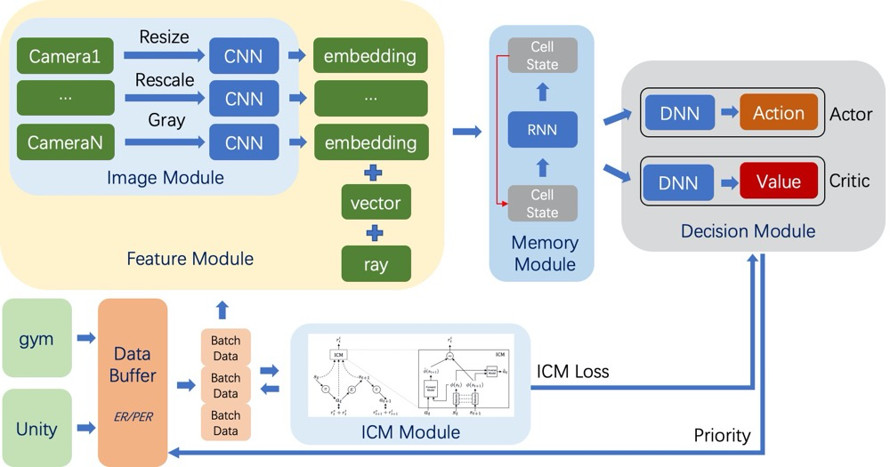

# RLs

:evergreen_tree::evergreen_tree::evergreen_tree:

Reinforcement Learning Algorithm Based On TensorFlow2.0.

This project includes SOTA or classic RL(reinforcement learning) algorithms used for training agents by interacting with Unity through [ml-agents](https://github.com/Unity-Technologies/ml-agents/tree/release_3) Release 3 or with [gym](https://github.com/openai/gym). The goal of this framework is to provide stable implementations of standard RL algorithms and simultaneously enable fast prototyping of new methods.



## About

It aims to fill the need for a small, easily grokked codebase in which users can freely experiment with wild ideas (speculative research).

### Characteristics

- Suitable for Windows, Linux, and OSX
- Almost reimplementation and competitive performance of original papers
- Reusable modules
- Clear hierarchical structure and easy code control
- Compatible with OpenAI Gym and Unity3D Ml-agents
- Restoring the training process from where it stopped, retraining on a new task, fine-tuning
- Using other training task's model as parameter initialization, specifying `--load`

### Supports

This project supports:
- Unity3D ml-agents.
- Gym{MuJoCo, [PyBullet](https://github.com/bulletphysics/bullet3), [gym_minigrid](https://github.com/maximecb/gym-minigrid)}, for now only two data types are compatible——`[Box, Discrete]`. Support 99.65% environment settings of Gym(except `Blackjack-v0`, `KellyCoinflip-v0`, and `KellyCoinflipGeneralized-v0`). ~~Support parallel training using gym envs, just need to specify `--gym-agents` to how many agents you want to train in parallel.~~(**Because of GIL, It turned out to be pseudo-multithreading**)
    - Discrete -> Discrete (observation type -> action type)
    - Discrete -> Box
    - Box -> Discrete
    - Box -> Box
    - Box/Discrete -> Tuple(Discrete, Discrete, Discrete)
- MultiAgent training. One brain controls multiple agents.
- MultiBrain training. Brains' model should be same algorithm or have the same learning-progress(perStep or perEpisode).
- MultiImage input(only for ml-agents). Images will resized to same shape before store into replay buffer, like `[84, 84, 3]`.
- Four types of ReplayBuffer, Default is ER: 
    - ER
    - n-step ER
    - [Prioritized ER](https://arxiv.org/abs/1511.05952)
    - n-step Prioritized ER
- [Noisy Net](https://arxiv.org/abs/1706.10295) for better exploration.
- [Intrinsic Curiosity Module](https://arxiv.org/abs/1705.05363) for almost all off-policy algorithms implemented.

### Advantages

- Parallel training multiple scenes for Gym
- Unified data format of environments between ml-agents and gym
- Just need to write a single file for other algorithms' implementation(Similar algorithm structure).
- Many controllable factors and adjustable parameters

## Implemented Algorithms

For now, these algorithms are available:

- Single-Agent training algorithms(Some algorithms that only support continuous space problems use Gumbel-softmax trick to implement discrete versions, i.e. DDPG):
    - Q-Learning, Sarsa, Expected Sarsa
    - :bug:Policy Gradient, PG
    - :bug:Actor Critic, AC
    - Advantage Actor Critic, A2C
    - [Trust Region Policy Optimization, TRPO](https://arxiv.org/abs/1502.05477)
    - :boom:[Proximal Policy Optimization, PPO](https://arxiv.org/abs/1707.06347)
    - [Deterministic Policy Gradient, DPG](https://hal.inria.fr/file/index/docid/938992/filename/dpg-icml2014.pdf)
    - [Deep Deterministic Policy Gradient, DDPG](https://arxiv.org/abs/1509.02971)
    - :fire:[Soft Actor Critic, SAC](https://arxiv.org/abs/1812.05905)
    - [Tsallis Actor Critic, TAC](https://arxiv.org/abs/1902.00137)
    - :fire:[Twin Delayed Deep Deterministic Policy Gradient, TD3](https://arxiv.org/abs/1802.09477)
    - Deep Q-learning Network, DQN, [2013](https://arxiv.org/pdf/1312.5602.pdf), [2015](https://storage.googleapis.com/deepmind-media/dqn/DQNNaturePaper.pdf)
    - [Double Deep Q-learning Network, DDQN](https://arxiv.org/abs/1509.06461)
    - [Dueling Double Deep Q-learning Network, DDDQN](https://arxiv.org/abs/1511.06581)
    - [Deep Recurrent Q-learning Network, DRQN](https://arxiv.org/abs/1507.06527)
    - [Deep Recurrent Double Q-learning, DRDQN](https://arxiv.org/abs/1908.06040)
    - [Category 51, C51](https://arxiv.org/abs/1707.06887)
    - [Quantile Regression DQN, QR-DQN](https://arxiv.org/abs/1710.10044)
    - [Implicit Quantile Networks, IQN](https://arxiv.org/abs/1806.06923)
    - [Rainbow DQN](https://arxiv.org/abs/1710.02298)
    - [MaxSQN](https://github.com/createamind/DRL/blob/master/spinup/algos/maxsqn/maxsqn.py)
    - [Soft Q-Learning, SQL](https://arxiv.org/abs/1702.08165)
    - [Bootstrapped DQN](http://arxiv.org/abs/1602.04621)
    - [Contrastive Unsupervised RL, CURL](http://arxiv.org/abs/2004.04136)
- Hierachical training algorithms:
    - [Option-Critic, OC](http://arxiv.org/abs/1609.05140)
    - [Asynchronous Advantage Option-Critic, A2OC](http://arxiv.org/abs/1709.04571)
    - [PPO Option-Critic, PPOC](http://arxiv.org/abs/1712.00004)
    - [Interest-Option-Critic, IOC](http://arxiv.org/abs/2001.00271)
    - [HIerarchical Reinforcement learning with Off-policy correction, HIRO](http://arxiv.org/abs/1805.08296)
- Multi-Agent training algorithms(*not support visual input yet*):
    - [Multi-Agent Deep Deterministic Policy Gradient, MADDPG](https://arxiv.org/abs/1706.02275)
    - Multi-Agent Deterministic Policy Gradient, MADPG
    - Multi-Agent Twin Delayed Deep Deterministic Policy Gradient, MATD3
- Safe Reinforcement Learning algorithms(*not stable yet*):
    - [Primal-Dual Deep Deterministic Policy Gradient, PD-DDPG](http://arxiv.org/abs/1802.06480)


|         Algorithms(29)          | Discrete | Continuous | Image | RNN  | Command parameter |
| :-----------------------------: | :------: | :--------: | :---: | :--: | :---------------: |
| Q-Learning/Sarsa/Expected Sarsa |    √     |            |       |      |        qs         |
|               PG                |    √     |     √      |   √   |      |        pg         |
|               AC                |    √     |     √      |   √   |  √   |        ac         |
|               A2C               |    √     |     √      |   √   |      |        a2c        |
|              TRPO               |    √     |     √      |   √   |      |       trpo        |
|               PPO               |    √     |     √      |   √   |      |        ppo        |
|               DQN               |    √     |            |   √   |  √   |        dqn        |
|           Double DQN            |    √     |            |   √   |  √   |       ddqn        |
|       Dueling Double DQN        |    √     |            |   √   |  √   |       dddqn       |
|        Bootstrapped DQN         |    √     |            |   √   |  √   |  bootstrappeddqn  |
|         Soft Q-Learning         |    √     |            |   √   |  √   |        sql        |
|               C51               |    √     |            |   √   |  √   |        c51        |
|             QR-DQN              |    √     |            |   √   |  √   |       qrdqn       |
|               IQN               |    √     |            |   √   |  √   |        iqn        |
|             Rainbow             |    √     |            |   √   |  √   |      rainbow      |
|               DPG               |    √     |     √      |   √   |  √   |        dpg        |
|              DDPG               |    √     |     √      |   √   |  √   |       ddpg        |
|             PD-DDPG             |    √     |     √      |   √   |  √   |      pd_ddpg      |
|               TD3               |    √     |     √      |   √   |  √   |        td3        |
|       SAC(has V network)        |    √     |     √      |   √   |  √   |       sac_v       |
|               SAC               |    √     |     √      |   √   |  √   |        sac        |
|               TAC               |   sac    |     √      |   √   |  √   |        tac        |
|             MaxSQN              |    √     |            |   √   |  √   |      maxsqn       |
|              MADPG              |          |     √      |       |  √   |      ma_dpg       |
|             MADDPG              |          |     √      |       |  √   |      ma_ddpg      |
|              MATD3              |          |     √      |       |  √   |      ma_td3       |
|               OC                |    √     |     √      |   √   |  √   |        oc         |
|               AOC               |    √     |     √      |   √   |  √   |        aoc        |
|              PPOC               |    √     |     √      |   √   |  √   |       ppoc        |
|               IOC               |    √     |     √      |   √   |  √   |        ioc        |
|              HIRO               |    √     |     √      |       |      |       hiro        |
|              CURL               |    √     |     √      |   √   |      |       curl        |

## Getting started

```python
"""
Usage:
    python [options]

Options:
    -h,--help                   显示帮助
    -a,--algorithm=<name>       算法, specify the training algorithm [default: ppo]
    -c,--copys=<n>              指定并行训练的数量, nums of environment copys that collect data in parallel [default: 1]
    -e,--env=<file>             指定Unity环境路径, specify the path of builded training environment of UNITY3D [default: None]
    -g,--graphic                是否显示图形界面, whether show graphic interface when using UNITY3D [default: False]
    -i,--inference              推断, inference the trained model, not train policies [default: False]
    -m,--models=<n>             同时训练多少个模型, specify the number of trails that using different random seeds [default: 1]
    -n,--name=<name>            训练的名字, specify the name of this training task [default: None]
    -p,--port=<n>               端口, specify the port that communicate with training environment of UNITY3D [default: 5005]
    -r,--rnn                    是否使用RNN模型, whether use rnn[GRU, LSTM, ...] or not [default: False]
    -s,--save-frequency=<n>     保存频率, specify the interval that saving model checkpoint [default: None]
    -t,--train-step=<n>         总的训练次数, specify the training step that optimize the policy model [default: None]
    -u,--unity                  是否使用unity客户端, whether training with UNITY3D editor [default: False]
    
    --unity-env=<name>          指定unity环境的名字, specify the name of training environment of UNITY3D [default: None]
    --config-file=<file>        指定模型的超参数config文件, specify the path of training configuration file [default: None]
    --store-dir=<file>          指定要保存模型、日志、数据的文件夹路径, specify the directory that store model, log and others [default: None]
    --seed=<n>                  指定模型的随机种子, specify the model random seed [default: 0]
    --unity-env-seed=<n>        指定unity环境的随机种子, specify the environment random seed of UNITY3D [default: 0]
    --max-step=<n>              每回合最大步长, specify the maximum step per episode [default: None]
    --train-episode=<n>         总的训练回合数, specify the training maximum episode [default: None]
    --train-frame=<n>           总的训练采样次数, specify the training maximum steps interacting with environment [default: None]
    --sampler=<file>            指定随机采样器的文件路径, specify the path of UNITY3D sampler [default: None]
    --load=<name>               指定载入model的训练名称, specify the name of pre-trained model that need to load [default: None]
    --prefill-steps=<n>         指定预填充的经验数量, specify the number of experiences that should be collected before start training, use for off-policy algorithms [default: None]
    --prefill-choose            指定no_op操作时随机选择动作，或者置0, whether choose action using model or choose randomly [default: False]
    --gym                       是否使用gym训练环境, whether training with gym [default: False]
    --gym-env=<name>            指定gym环境的名字, specify the environment name of gym [default: CartPole-v0]
    --gym-env-seed=<n>          指定gym环境的随机种子, specify the environment random seed of gym [default: 0]
    --render-episode=<n>        指定gym环境从何时开始渲染, specify when to render the graphic interface of gym environment [default: None]
    --info=<str>                抒写该训练的描述，用双引号包裹, write another information that describe this training task [default: None]
    --use-wandb                 是否上传数据到W&B, whether upload training log to WandB [default: False]
Example:
    python run.py -a sac -g -e C:/test.exe -p 6666 -s 10 -n test --config-file config.yaml --max-step 1000 --train-episode 1000 --sampler C:/test_sampler.yaml --unity-env Roller
    python run.py -a ppo -u -n train_in_unity --load last_train_name
    python run.py -ui -a td3 -n inference_in_unity
    python run.py -gi -a dddqn -n inference_with_build -e my_executable_file.exe
    python run.py --gym -a ppo -n train_using_gym --gym-env MountainCar-v0 --render-episode 1000 -c 4
    python run.py -u -a ddpg -n pre_fill --prefill-steps 1000 --prefill-choose
"""
```

If you specify **gym**, **unity**, and **envrionment executable file path** simultaneously, the following priorities will be followed: gym > unity > unity_env.

## Notes

1. log, model, training parameter configuration, and data are stored in `C:/RLdata` for Windows, or `$HOME/RLdata` for Linux/OSX
2. maybe need to use command `su` or `sudo` to run on a Linux/OSX
3. record directory format is `RLdata/Environment/Algorithm/Group name(for ml-agents)/Training name/config&excel&log&model`
4. make sure brains' number > 1 if specifing `ma*` algorithms like maddpg
5. multi-agents algorithms doesn't support visual input and PER for now
6. **need 3 steps to implement a new algorithm**
    1. write `.py` in `algos/tf2algos` directory and make the policy inherit from class `Policy`, `On_Policy` or `Off_Policy`
    2. write default configuration in `algos/tf2algos/config.yaml`
    3. register new algorithm at dictionary *algos* in `algos/tf2algos/register.py`, i.e. `'dqn':      {'class': 'DQN',    'policy': 'off-policy', 'update': 'perStep'}`, make sure the classname matches the name of the algorithm class
7. set algorithms' hyper-parameters in [algos/tf2algos/config.yaml](https://github.com/StepNeverStop/RLs/blob/master/algos/tf2algos/config.yaml)
8. set training default configuration in [config.py](https://github.com/StepNeverStop/RLs/blob/master/config.py)
9. change neural network structure in [rls/tf2nn.py](https://github.com/StepNeverStop/RLs/blob/master/rls/tf2nn.py)

## Ongoing things

- Fix multi-agent algorithms
- DARQN
- ACER
- Ape-X
- R2D2
- ~~ACKTR~~

## Installation

### Dependencies

- python>3.6, <=3.8
- tensorflow>=2.1.0
- numpy
- pywin32==224
- docopt
- pyyaml
- pillow
- openpyxl
- gym
- opencv-python
- ray, ray[debug] for OS based on Linux

### Install

```bash
$ git clone https://github.com/StepNeverStop/RLs.git
```
pip package coming soon.

## Giving credit

If using this repository for your research, please cite:
```
@misc{RLs,
  author = {Keavnn},
  title = {RLs: Reinforcement Learning research framework for Unity3D and Gym},
  year = {2019},
  publisher = {GitHub},
  journal = {GitHub repository},
  howpublished = {\url{https://github.com/StepNeverStop/RLs}},
}
```

## Issues

Any questions about this project or errors about my bad grammer, plz let me know in [this](https://github.com/StepNeverStop/RLs/issues/new).


