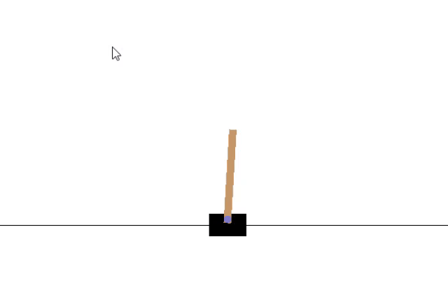
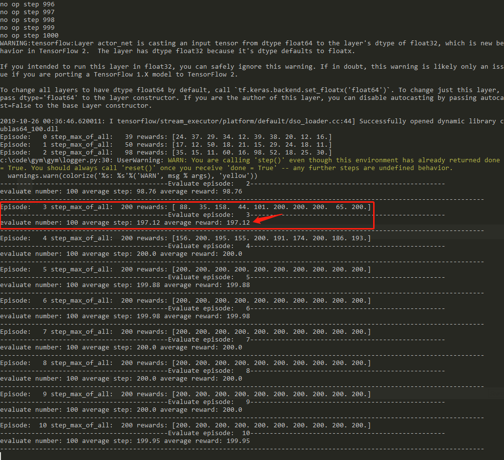
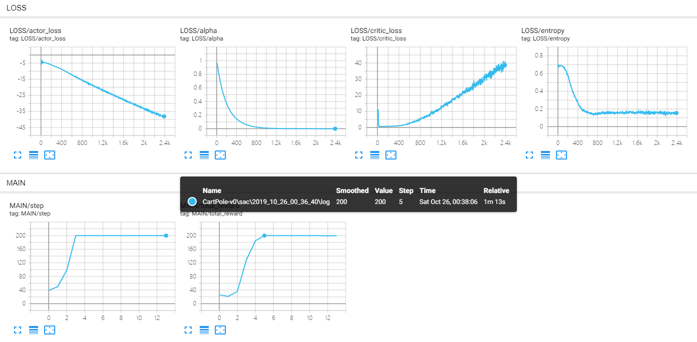

# CartPole-v0

- Convergence episode: 0
- max step per episode: 200
- algorithm: td3+gumbel[[code]( https://github.com/StepNeverStop/RLs/blob/master/Algorithms/tf2algos/td3.py )]
- Actor
- - 64 -> 32 -> logits
- Critic
- - 64 -> 64 -> 1
- n_step: 4
- step_before_train(random): 10000
- agents in parrallel: 10

Parameters:
```
'gamma': 0.999,
'ployak': 0.995,
'lr': 5.0e-3,
'max_episode': 50000,
'discrete_tau': 1.0, # discrete_tau越小，gumbel采样的越接近one_hot，但相应的梯度也越小
'batch_size': 8192,
'buffer_size': 200000,
'use_priority': False,
'n_step': True,
```

Result:







