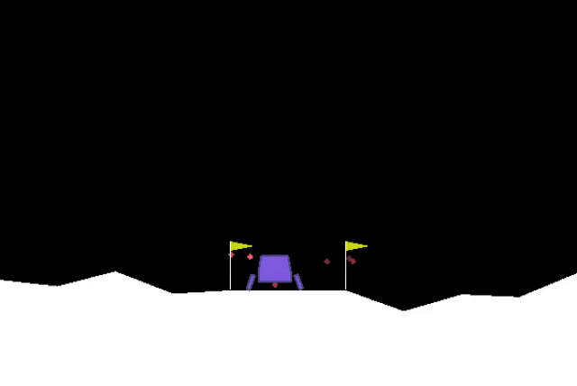
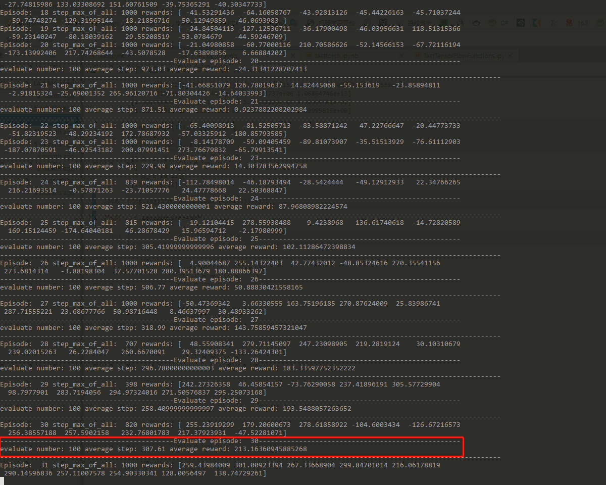
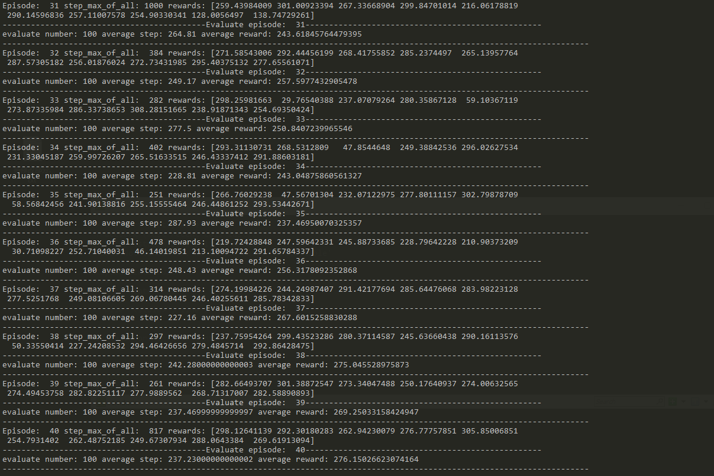
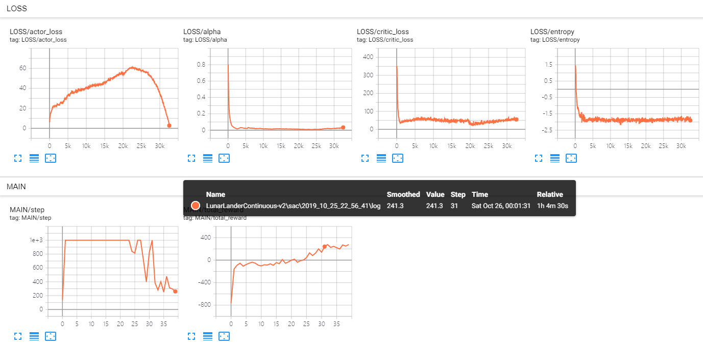

# LunarLanderContinuous-v2

- Convergence episode: 30
- max step per episode: 1000
- algorithm: sac[[code]( https://github.com/StepNeverStop/RLs/blob/master/Algorithms/tf2algos/sac.py )]
- Actor
- - 64(share) -> 64(share) -> 32 -> 32 -> mu(tanh)
- - 64(share) -> 64(share) -> 32 -> 32 -> sigma(sigmoid)
- Critic_Q
- - 64 -> 64 -> 1
- Critic_V
- - 32 -> 32 -> 1
- n_step: 4
- step_before_train(random): 10000
- agents in parrallel: 10

Parameters:
```
'alpha': 0.2,
'auto_adaption': True,
'gamma': 0.999,
'ployak': 0.995,
'lr': 5.0e-3,
'max_episode': 50000,
'batch_size': 8192,
'buffer_size': 200000,
'use_priority': False,
'n_step': True
```

Result:









