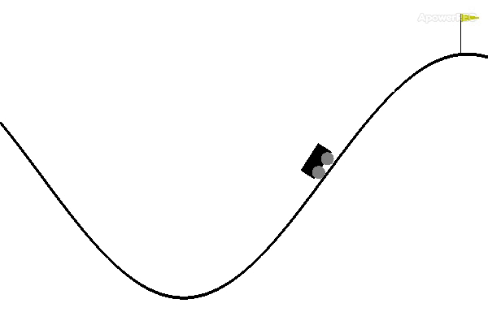
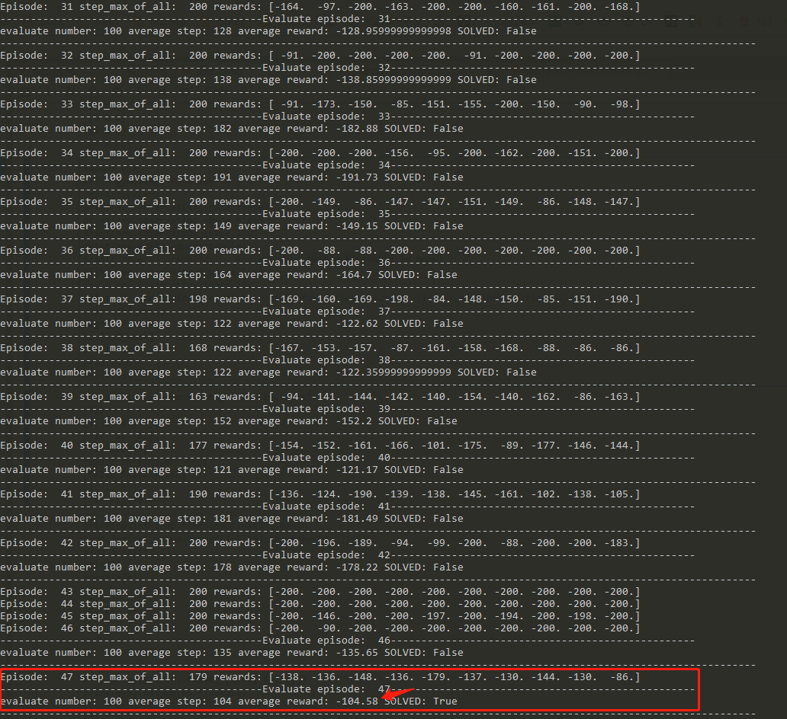
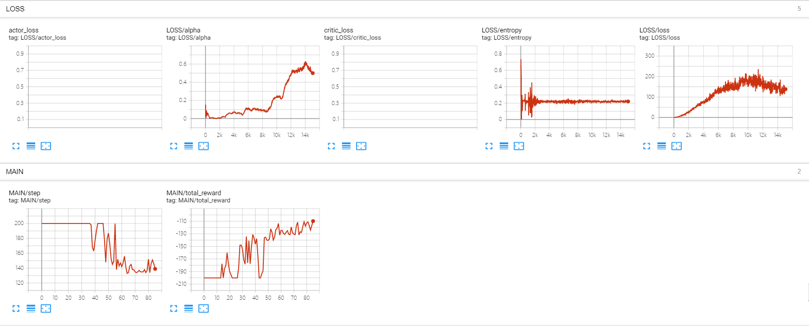

# MountainCar-v0

- Convergence episode: 47
- max step per episode: 200
- algorithm: maxsqn[[code](https://github.com/StepNeverStop/RLs/blob/master/algos/single/maxsqn.py)], reimplementation from [createamind](https://github.com/createamind/DRL/blob/master/spinup/algos/maxsqn/maxsqn.py)
- Q:
- - 32 -> 32 -> logits
- n_step: 4
- step_before_train(random): 10000
- agents in parrallel: 10

Parameters:
```
'alpha': 0.2,
'beta': 0.2,    # 0 <= beta < 1, when beta approaches 1, the distribution of convergence points is closer to uniform distribution, means more entropy. when beta approaches 0, the final policy is more deterministic.
'epsilon': 0.2,
'use_epsilon': False,
'auto_adaption': True,
'lr': 1.0e-1,
'max_train_episode': 50000,
'gamma': 0.999,
'ployak': 0.995,
'batch_size': 8192,
'buffer_size': 200000,
'use_priority': False,
'n_step': True
```

Result:







