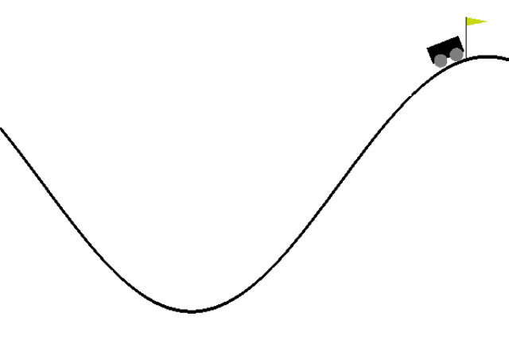
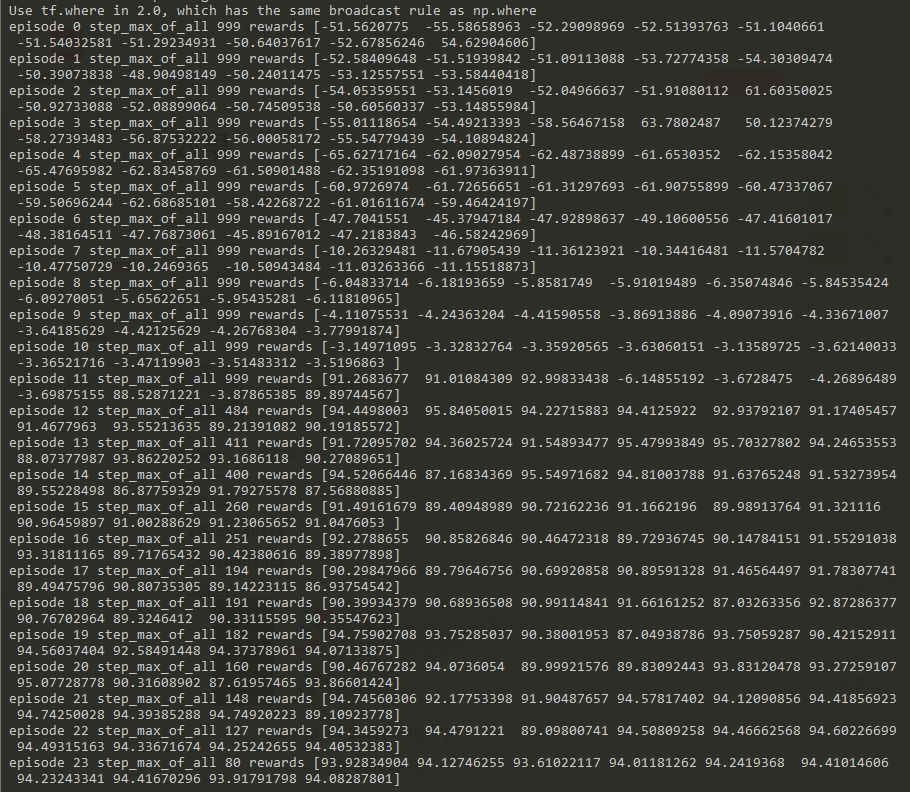
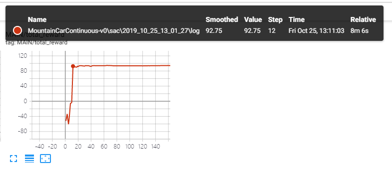

# MountainCarContinuous-v0

- Convergence episode: 11
- max step per episode: 999
- algorithm: sac[[code](https://github.com/StepNeverStop/RLs/blob/master/algos/single/sac.py)]
- Actor
- - 64(share) -> 64(share) -> 32 -> 32 -> mu(tanh)
- - 64(share) -> 64(share) -> 32 -> 32 -> sigma(sigmoid)
- Critic_Q
- - 64 -> 64 -> 1
- Critic_V
- - 32 -> 32 -> 1
- n_step: 4
- step_before_train(random): 10000
- agents in parrallel: 10

Parameters:
```
'auto_adaption': True,
'gamma': 0.99,
'ployak': 0.995,
'lr': 5.0e-4,
'max_train_episode': 50000,
'batch_size': 4096,
'buffer_size': 200000,
'use_priority': False,
'n_step': True
```

Result:







