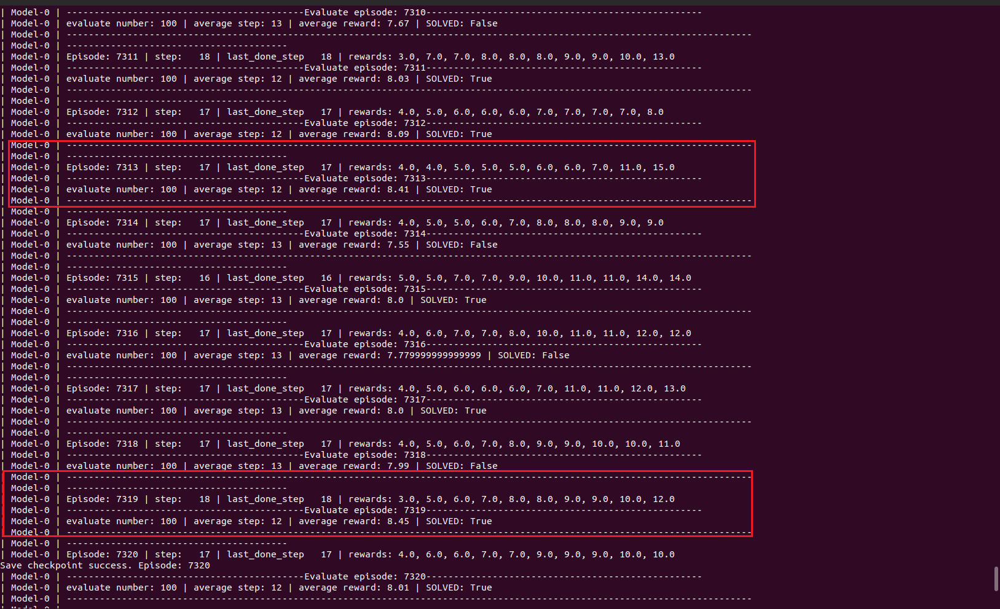
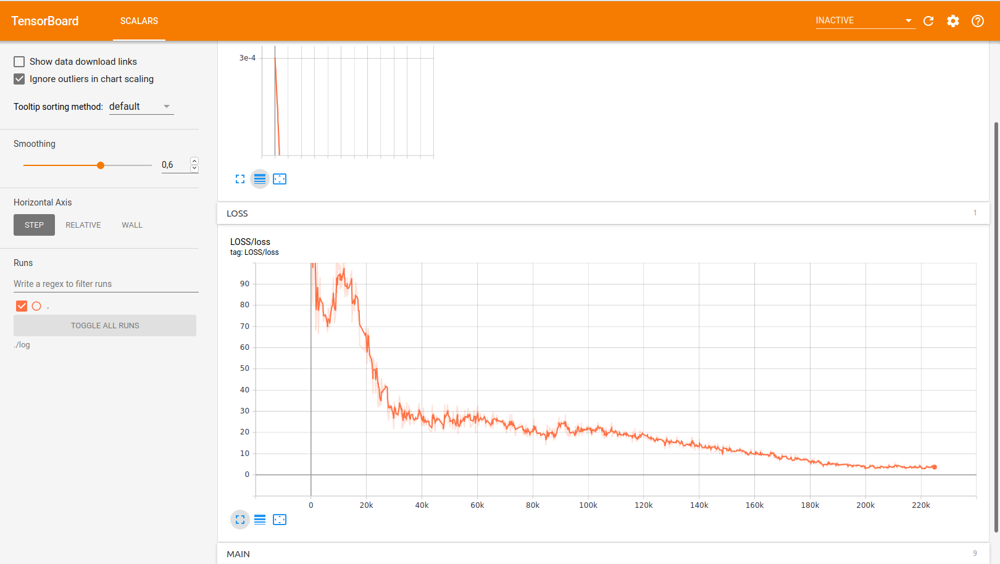

# Taxi-v3

- Convergence episode: first ~ 1000, last ~7300 (max average reward for 100 episodes - 8.45)
- max step per episode: 200
- algorithm: DQN
- step_before_train(random): 2500
- agents in parrallel: 10

Parameters:
```
algo:
  assign_interval: 1000
  batch_size: 1024
  buffer_size: 100000
  eps_final: 0.01
  eps_init: 1
  eps_mid: 0.2
  gamma: 0.8493465599999999
  hidden_units:
  - 32
  - 32
  init2mid_annealing_episode: 100
  lr: 0.0003
  n_step: true
  use_priority: false
buffer:
  ER: {}
  EpisodeER: {}
  NstepER:
    agents_num: 10
    gamma: 0.96
    n: 4
  NstepPER:
    alpha: 0.6
    beta: 0.4
    epsilon: 0.01
    global_v: false
    n: 4
  PER:
    alpha: 0.6
    beta: 0.4
    epsilon: 0.01
    global_v: false
  Pandas: {}
  batch_size: 1024
  buffer_size: 100000
  type: NstepER
env:
  action_skip: false
  env_name: Taxi-v3
  env_num: 10
  env_seed: 0
  noop: false
  noop_max: 30
  obs_grayscale: false
  obs_resize: false
  obs_scale: false
  obs_stack: false
  render_mode: random_1
  resize:
  - 84
  - 84
  skip: 4
  stack: 4
  type: gym
model:
  algo: dqn
  algo_config: dqn-taxiv3.yaml
  load: null
  logger2file: false
  policy_mode: off-policy
  seed: 0
train:
  add_noise2buffer: false
  add_noise2buffer_episode_interval: 10
  add_noise2buffer_steps: 1000
  all_learner_print: true
  base_dir: Taxi-v3/dqn
  begin_episode: 0
  eval_while_train: true
  fill_in: false
  index: 0
  inference: false
  info: None
  load_model_path: Taxi-v3/dqn/train_using_gym-0
  max_episode: 5000
  max_eval_episode: 100
  max_step: 2000
  max_total_step: 1000000
  moving_average_episode: 100
  name: train_using_gym-0
  off_policy_step_eval: true
  off_policy_step_eval_num: 1
  pre_fill_steps: 10000
  prefill_choose: false
  render: false
  render_episode: 50000
  save_frequency: 20
  total_step_control: true

```

Result:






